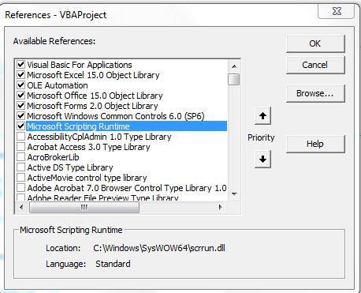

# Accounting-Programs-Excel
---

## 📋 Overview

Програми на Ексел с използване на макроси. 
Премахване на парола от проект с макрос,
Макрос словом

---

## ⚙️ Requirements



---

## I. Accounting v 1.2022 TEMPLATE-32&64 2022.xls

## II. Amortization v 1.3 TEMPLATE-32&64.xls

## III. Calculator Staj v 1.1-32&64.xls

## IV. GFO v 1.1 TEMPLATE '0-'000 BGN 2022.xls

## V. Invoice v 1.0 TEMPLATE.xls

## VI. Rabotni Zaplati

### 6.1. Rabotni Zaplati v 1.4 TEMPLATES-32&64 2022.xls

### 6.1. Rabotni Zaplati v 1.4 TEMPLATES-32&64 2023.xls

### 6.1. Rabotni Zaplati v 1.5 TEMPLATES-32&64 2024.xls

### 6.1. Rabotni Zaplati v 1.5 TEMPLATES-32&64 2025.xls

### 6.1. Rabotni Zaplati v 1.6 TEMPLATES-32&64 2026.xls

## VII. Macros

### 7.1. Macros - словом

```bash
Public Function ToWords(ByVal dblValue As Double, Optional Measure As Variant, Optional Gender As Variant, Optional NumScale As Variant) As String
    Dim vDigits         As Variant
    Dim vGenderDigits   As Variant
    Dim vValue          As Variant
    Dim lIdx            As Long
    Dim lDigit          As Long
    Dim sResult         As String
    
    '--- fix optional params default values
    If IsMissing(Gender) Then
        Gender = vbNullString
    End If
    If IsMissing(NumScale) Then
        NumScale = 2
    End If
    '--- init digits (incl. gender ones)
    vDigits = Split("нула едно две три четири пет шест седем осем девет")
    vGenderDigits = Split(Join(vDigits))
    Select Case Left$(Gender, 1)
    Case vbNullString, "M", ""
        vGenderDigits(1) = "един"
        vGenderDigits(2) = "два"
    Case "F"
        vGenderDigits(1) = "една"
    End Select
    '--- split input value on decimal point and pad w/ zeroes
    vValue = Mid$(Format$(0, "0.0"), 2, 1)
    vValue = Split(Format$(Abs(dblValue), "0." & String(NumScale, "0")), vValue)
    vValue(0) = Right$(String$(18, "0") & vValue(0), 18)
    '--- loop input digits from right to left
    For lIdx = 1 To Len(vValue(0))
        If lIdx <= 3 Then
            lDigit = Mid$(vValue(0), Len(vValue(0)) - lIdx + 1, 1)
        Else
            lDigit = Mid$(vValue(0), Len(vValue(0)) - lIdx - 1, 3)
            lIdx = lIdx + 2
        End If
        If lDigit <> 0 Then
            '--- separate by space (first time prepend "и" too)
            If LenB(sResult) <> 0 And (lIdx <> 2 Or lDigit <> 1) Then
                If InStr(sResult, " и ") = 0 Then
                    sResult = " и " & sResult
                Else
                    sResult = " " & sResult
                End If
            End If
            Select Case lIdx
            Case 1
                sResult = vGenderDigits(lDigit) & sResult
            Case 2
                If lDigit = 1 Then
                    '--- 11 to 19 special wordforms
                    If LenB(sResult) <> 0 Then
                        sResult = Replace(LTrim$(sResult), vGenderDigits(1), "еди")
                        sResult = Replace(sResult, vGenderDigits(2), "два") & "надесет"
                    Else
                        sResult = "десет"
                    End If
                Else
                    sResult = IIf(lDigit = 2, "два", vDigits(lDigit)) & "десет" & sResult
                End If
            Case 3
                '--- hundreds have special suffixes for 2 and 3
                Select Case lDigit
                Case 1
                    sResult = "сто" & sResult
                Case 2, 3
                    sResult = vDigits(lDigit) & "ста" & sResult
                Case Else
                    sResult = vDigits(lDigit) & "стотин" & sResult
                End Select
            Case 6
                '--- thousands are in feminine gender
                Select Case lDigit
                Case 1
                    sResult = "хиляда" & sResult
                Case Else
                    sResult = ToWords(lDigit, vbNullString, Gender:="F") & " хиляди" & sResult
                End Select
            Case 9, 12, 15
                '--- no special cases for bigger values
                sResult = ToWords(lDigit, vbNullString) & " " & Split("милион милиард трилион квадрилион")((lIdx - 9) \ 3) _
                    & IIf(lDigit <> 1, "а", vbNullString) & sResult
            End Select
        End If
    Next
    '--- handle zero and negative values
    If LenB(sResult) = 0 Then
        sResult = vDigits(0)
    End If
    If dblValue < 0 Then
        sResult = "минус " & sResult
    End If
    '--- apply measure (use Measure:=vbNullString for none)
    If IsMissing(Measure) Then
        Measure = IIf(Val(vValue(0)) = 1, "лев", "лв.") & "|ст."
        Gender = "MF"
    End If
    If LenB(Measure) <> 0 Then
        If Right$(sResult, Len(vDigits(0))) = vDigits(0) And Val(vValue(1)) <> 0 And InStr(Measure, "|") > 0 Then
            sResult = ToWords(IIf(dblValue < 0, -1, 1) * Val(vValue(1)), Split(Measure, "|")(1), Mid$(Gender, 2))
        Else
            sResult = sResult & " " & Split(Measure, "|")(0)
            If Val(vValue(1)) <> 0 Or InStr(Measure, "|") > 0 Then
                sResult = sResult & " и " & vValue(1)
            End If
            If InStr(Measure, "|") > 0 Then
                sResult = sResult & " " & Split(Measure, "|")(1)
            End If
            sResult = UCase$(Left$(sResult, 1)) & Mid$(sResult, 2)
        End If
    End If
    ToWords = sResult
End Function

Public Function ToAllWords(ByVal dblValue As Double) As String
    ToAllWords = ToWords(Int(dblValue), "лв.") & " и " & LCase$(ToWords(Round((dblValue - Int(dblValue)) * 100), "ст.", "F"))
End Function
```

### 7.2. Slovom AI.xlsm

## Remove VBA Project Password

Направи **bat** файл със следния код:

```bash
Option Explicit

Private Const PAGE_EXECUTE_READWRITE = &H40

Private Declare Sub MoveMemory Lib "kernel32" Alias "RtlMoveMemory" _
        (Destination As Long, Source As Long, ByVal Length As Long)

Private Declare Function VirtualProtect Lib "kernel32" (lpAddress As Long, _
        ByVal dwSize As Long, ByVal flNewProtect As Long, lpflOldProtect As Long) As Long

Private Declare Function GetModuleHandleA Lib "kernel32" (ByVal lpModuleName As String) As Long

Private Declare Function GetProcAddress Lib "kernel32" (ByVal hModule As Long, _
        ByVal lpProcName As String) As Long

Private Declare Function DialogBoxParam Lib "user32" Alias "DialogBoxParamA" (ByVal hInstance As Long, _
        ByVal pTemplateName As Long, ByVal hWndParent As Long, _
        ByVal lpDialogFunc As Long, ByVal dwInitParam As Long) As Integer

Dim HookBytes(0 To 5) As Byte
Dim OriginBytes(0 To 5) As Byte
Dim pFunc As Long
Dim Flag As Boolean

Private Function GetPtr(ByVal Value As Long) As Long
    GetPtr = Value
End Function

Public Sub RecoverBytes()
    If Flag Then MoveMemory ByVal pFunc, ByVal VarPtr(OriginBytes(0)), 6
End Sub

Public Function Hook() As Boolean
    Dim TmpBytes(0 To 5) As Byte
    Dim p As Long
    Dim OriginProtect As Long

    Hook = False

    pFunc = GetProcAddress(GetModuleHandleA("user32.dll"), "DialogBoxParamA")


    If VirtualProtect(ByVal pFunc, 6, PAGE_EXECUTE_READWRITE, OriginProtect) <> 0 Then

        MoveMemory ByVal VarPtr(TmpBytes(0)), ByVal pFunc, 6
        If TmpBytes(0) <> &H68 Then

            MoveMemory ByVal VarPtr(OriginBytes(0)), ByVal pFunc, 6

            p = GetPtr(AddressOf MyDialogBoxParam)

            HookBytes(0) = &H68
            MoveMemory ByVal VarPtr(HookBytes(1)), ByVal VarPtr(p), 4
            HookBytes(5) = &HC3

            MoveMemory ByVal pFunc, ByVal VarPtr(HookBytes(0)), 6
            Flag = True
            Hook = True
        End If
    End If
End Function

Private Function MyDialogBoxParam(ByVal hInstance As Long, _
        ByVal pTemplateName As Long, ByVal hWndParent As Long, _
        ByVal lpDialogFunc As Long, ByVal dwInitParam As Long) As Integer
    If pTemplateName = 4070 Then
        MyDialogBoxParam = 1
    Else
        RecoverBytes
        MyDialogBoxParam = DialogBoxParam(hInstance, pTemplateName, _
                           hWndParent, lpDialogFunc, dwInitParam)
        Hook
    End If
End Function

Sub unprotected()
    If Hook Then
        MsgBox "VBA Project is unprotected!", vbInformation, "*****"
    End If
End Sub
```